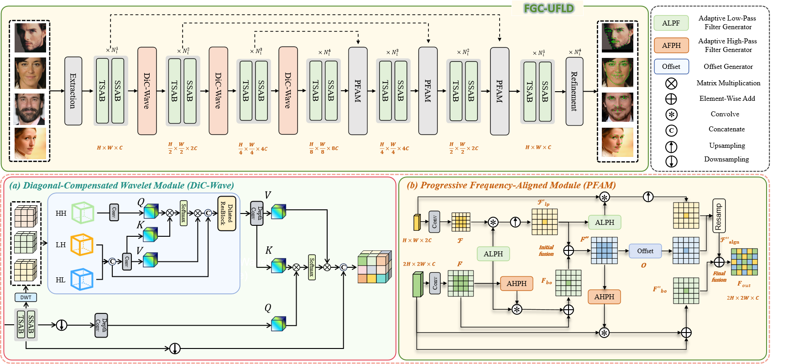

<h1 align="center">
Frequency-Aware Gradient Correction for Unified Facial Landmark Detection
</h1>

[//]: # (<p align="center">)

[//]: # (<strong>📄 Under Review at Expert Systems with Applications &#40;ESWA&#41;</strong>)

[//]: # (</p>)

<p align="center">
<a href="#">📑 Paper (under review)</a> •
<a href="https://github.com/17762682759/FGC-UFLD">💻 Code</a> 
</p>

<p align="center">
  
</p>

---

## 📊 Datasets

Experiments are conducted on four widely-used facial landmark benchmarks:

| Dataset | Download |
|--------|----------|
| **AFLW** | https://drive.google.com/drive/folders/1CG-6OxaJpkwmzHNnPHEAU7y_fVjMjIAl |
| **300W** | https://drive.google.com/drive/folders/1uNnaVCoB5cUaT6JZVQtSU5FcYA967GWk |
| **COFW** | https://drive.google.com/drive/folders/1lHvLzYnsqziZw7FI8AbmCOfmZSYvIZ0b |
| **WFLW** | https://drive.google.com/drive/folders/1shd-yo8OkNzi9HkGulUI4v6lG38qUOWs |

Please refer to the paper for preprocessing and evaluation protocols.

---

## 🚀 Training

After preparing the datasets, FGC-UFLD can be trained with:

```bash
python main.py
```

## 📬 Contact
Qingjia Li

School of Computer Science

China Three Gorges University

## 📧 Email:

1990760379@qq.com

